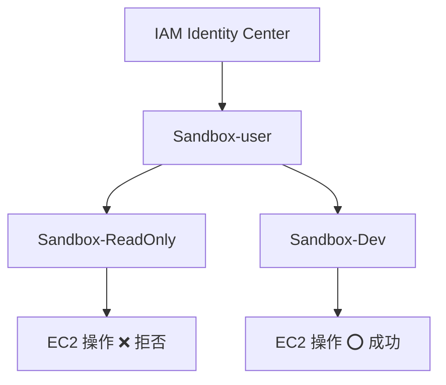
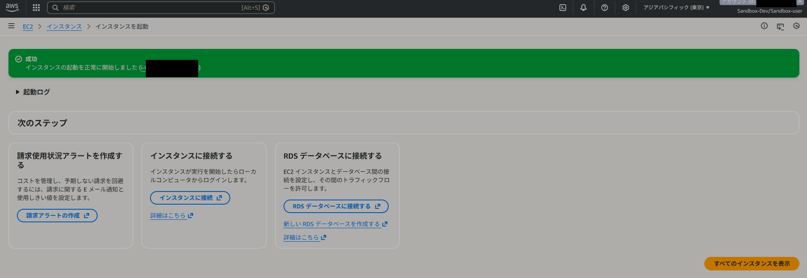
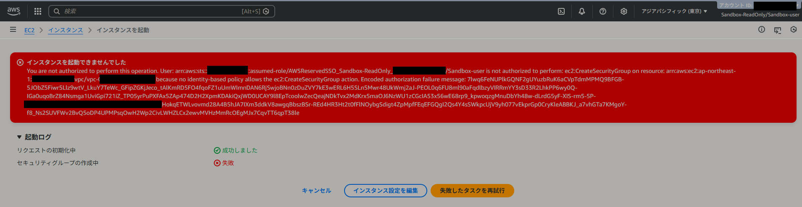

# AWS IAM Permission Set Portfolio

## 概要
本リポジトリは、AWS IAM Identity Center の **Permission Set** を用いた  
**権限分離およびロール切り替え運用の設計・検証**を行ったポートフォリオです。

単一ユーザーに対して複数の Permission Set を割り当て、  
業務内容に応じてロールを切り替えることで、  
**同一条件下でも操作可否が変化すること**を実動作で検証しています。

※ 本ポートフォリオでは、IAM Identity Center のうち  
Permission Set を用いた権限分離・ロール切り替え運用に焦点を当てています。  

---

## 構成図

## 検証目的
本検証では、以下を目的としています。

- IAM Identity Center によるユーザーと権限の分離設計の理解
- Permission Set 切り替えによる操作可否の差異確認
- 管理者権限を常用しない運用モデルの検証

---

## 構成

### 使用サービス
- AWS IAM Identity Center
- AWS Organizations
- Amazon EC2

### ユーザー / 権限構成
- ユーザー
  - `Sandbox-user`（単一）
- Permission Set
  - `Sandbox-ReadOnly`（ReadOnlyAccess）
  - `Sandbox-Dev`（PowerUserAccess）
  - `Sandbox-Admin`（AdministratorAccess / 補足）

ユーザー名には役割を含めず、  
**権限は Permission Set 側で管理する設計**としています。

---

## 権限検証マトリクス（EC2）

同一ユーザー・同一リージョン（ap-northeast-1）にて、  
Permission Set のみを切り替えて検証を行いました。

| ユーザー | Permission Set | 操作内容 | 結果 | 備考 |
|---|---|---|---|---|
| Sandbox-user | Sandbox-ReadOnly | EC2 作成 / 起動 | ❌ | IAM（ReadOnlyAccess により拒否） |
| Sandbox-user | Sandbox-Dev | EC2 作成 / 起動 | ⭕ | 正常に起動（Running 確認） |

---

## エビデンス

### Dev 権限（成功）
EC2 インスタンスの作成および起動が成功することを確認。

### ReadOnly 権限（拒否）
EC2 作成時に IAM 権限で拒否されることを確認。

---

## 検証内容詳細

### ReadOnly 権限での検証
- EC2 インスタンス作成を試行
- セキュリティグループ作成時に AccessDenied
- 変更操作が IAM 権限で拒否されることを確認

### Dev 権限での検証
- EC2 インスタンス作成および起動が可能
- インスタンスが Running 状態となることを確認
- ReadOnly 権限との差異を明確に確認

---

## 運用上の考慮
- 管理者権限（Sandbox-Admin）は常用しない前提
- 検証後、作成した EC2 インスタンスは停止・削除
- 不要なリソースが残らないよう配慮

---

## 学び
- Permission Set により、ユーザーと権限を分離したロールベース管理が可能である
- 同一ユーザーでもロール切り替えにより操作可否が変化する
- 権限検証は机上ではなく、実動作確認が重要である

---

## まとめ
本ポートフォリオを通じて、  
IAM Identity Center を用いた権限分離設計から  
ロール切り替え運用、権限制御の優先関係までを  
一連の流れとして検証しました。

実務環境においても、  
権限事故を防止するための設計・検証手法として  
応用可能な構成であると考えています。
